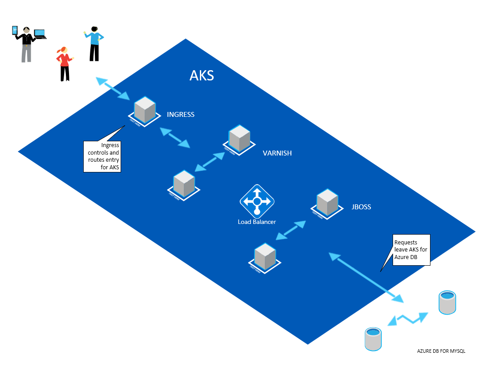

# High Performance JBoss hosting in AKS, using Varnish, CDN and MySQL.

## Overview

The solution will be hosted in Azure.
Static content will be hosted in Blob Storage.  
AKS will deliver services used for Web App and REST Api endpoints.  
Varnish caching will be used to reduce the number of requests to the Jboss application layer, and Redis will be used to reduce the number of requests to the MySQL DB layer.  
  
The initial setup will forego the CDN and Redis integration, which can be used to optimize the solution in later stages.  
Azure Kubernetes Service (AKS) will be used to host the varnish and jboss components.  

In a later stage, CDN will be used to offload requests for static content from the main cloud infrastructure.  

You can use the following sections to get more information:

## [Dependencies](./dependecies.md)

## [Setup of Pre-Requisites](pre-req_setup.md)

