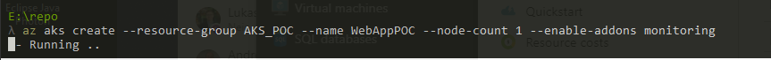

## Setup Procedure

Here we prepare the clound environment in which we shall be running the POC.  
We shall setup the various components to host the web apps and assocaited storage and caches.  

### Step 1 - Create the first resources

Run the following commands in a shell which has the Azure CLI available.

```shell
# Login to Azure with the CLI
az login

# Create a resource group in which we will place the components to be used in the POC
az group create --name AKS_POC --location WestEurope

# Create the Network and Subnets
az network vnet create --name pocVNet --resource-group AKS_POC --location westeurope --address-prefix 10.1.0.0/16 --subnet-name gatewaySubnet --subnet-prefix 10.1.1.0/24

az network vnet subnet create --name aksSubnet --resource-group AKS_POC --vnet-name pocVNet --address-prefix 10.1.2.0/24

az network public-ip create --resource-group AKS_POC --name gatewayPublicIPAddress

# store the network object for later (this is powershell)
$network = az network vnet subnet list --resource-group AKS_POC --vnet-name pocVnet --query [].id --output tsv | sls backend | select -exp line

# Create an Azure Container Registry for publishing and to store our images
az acr create --name akspoc --resource-group AKS_POC --sku Basic

# Create an AKS Cluster, with node count of 1 (as this is the initial configuration for POC) node type and count can be adjusted as needed. RBAC is enabled by default.
az aks create --resource-group AKS_POC --name WebAppPOC --network-plugin azure --vnet-subnet-id $network --docker-bridge-address 172.17.0.1/16 --dns-service-ip 10.2.0.10 --service-cidr 10.2.0.0/24 --node-count 1 --enable-addons monitoring
```

Azure will take a little while to provision all the required resources:



You can open a parallel shell session, and execute the following commands to create the Web Application Firewall / Application Gateway (Available as create_WAF_network script in the **./scripts** folder):


### Step 2 - Configure AKS creds & validate

When finished, you can use the following command to create a local entry on your client that can be used to automatically log into the AKS env:
```shell
az aks get-credentials -g AKS_POC -n WebAppPOC
```
You will see the resulting output indicating that the credentials are merged into a local credentials file:


to verify that the nodes are online and running, using the following command:
```shell
kubectl get nodes
```

### Step 3 - Initialize Helm

In order to use Helm, we need to initialize it.  
Before that, we need to create a service account for helm to use called "tiller".  

Assuming you have cloned this repo, use the following command to create the tiller account:

```shell
kubectl create -f ./aks_setup_yaml_files/rbac_for_tiller.yaml
```

This should result in the account being added in the cluster role bindings:  


This will allow us to use the helm charts to publish services and configure AKS.  
We then initialize Helm on our local system, to use this tiller account with:

```shell
helm init --service-account tiller
```

Resulting in


You can validate that Helm is properly initialized by running

```shell
kubectl -n kube-system get deployments
```

This will show the "tiller-deploy" deployment


### Step 3 - Prepare and publish docker images

Now, if you have not already done so, go [here](./docker_prep.md) to prepare and publish your docker images.

### Step 4 - Give AKS Access to the registry

Full details are here:

https://docs.microsoft.com/en-us/azure/container-registry/container-registry-auth-aks

You can also use the bash or powershell scripts that we have provided under ./scripts

Please ensure that you modify the names of the resources to match your environment!

### Step 4 - Prepare the helm charts

We have supplied some sample Helm charts for our Jboss / Wildfly sample under ./helmcharts/jbossappserver.

These define the parameters for deploying packages to the kubernetes cluster.

Before deploying to your own cluster, you will need to modify the ./helmcharts/jbossappserver/values.yaml as follows:

- line 11 - under image, change repository to match where you published your images.
- Optional - only if we were using an Ingress controller, we would need to also update  
    we are using a load balancer in the sample architecture, so this is not necessary.
    - line 32 - under hosts - to match our DNS endpoint & host name (for routing the requests)
    - line 34 - if using the let's encrypt and cert manager to enable TLS, we would need to update host name and secrets here.

Once the Heml chart's value.yaml has been updated, we can deploy.

if you want to double check the tags you used when deploying to acr... you can use something like:

```shell
az acr repository show-tags --name akspoc --repository jboss
```

otherwise, just deploy with Helm, ensuring you change to the ./helm/jbossappserver folder in the shell,  using:

```shell
# from within the ./helm/jbossappserver folder
helm upgrade --install --wait --set image.tag=v0.1 jbossappserver .
```

You will see, that helm indicates that the release "jbossappserver" does not exist, and deployment begins:


while you wait for it to finish setting up, you can use the following to check on the status:

```shell
kubectl get deployments
```

or

kubectl get pods

then run the following to install the varnish cache:

cd ../varnish

```shell
helm upgrade --install --wait --set image.tag=v1.0 varnish .
```
