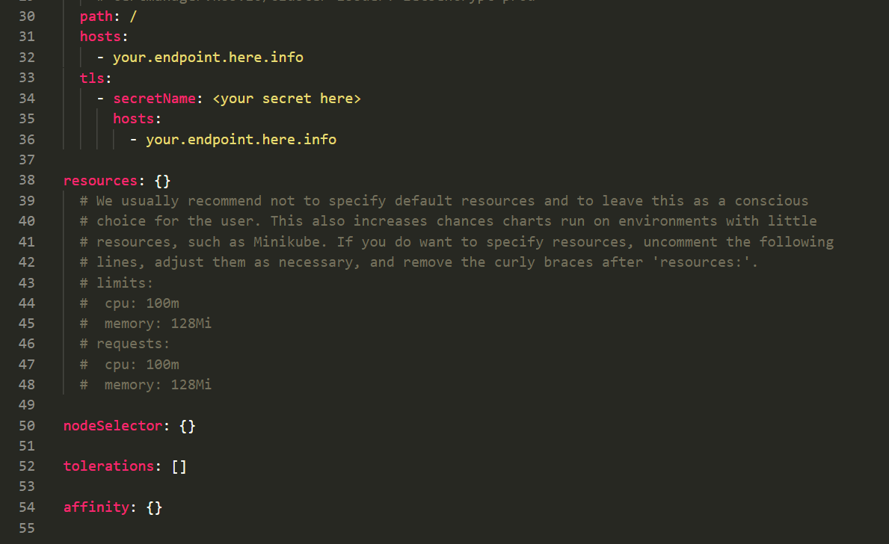

# Tuning and Scaling AKS

Throughput and performance of the AKS nodes and application instances can be monitored via the metrics shown in the insights section, as well as in the logs if container logging is being used for metric evaluation.

Application performance telemetry can also be routed to [ApplicationInsights](https://docs.microsoft.com/en-us/azure/application-insights/app-insights-overview).

Performance charts can be pinned to a dashboard for convenience during the POC:


AKS nodes and instances can be scaled separately.
In such a case, it is important that the limits for the containers are set in the helm charts to ensure that Kubernetes does not start too many instances on a single node.



Scale nodes:

```shell
az aks scale --name Varnish --node-count 2 --resource-group AKS_POC --no-wait
```


