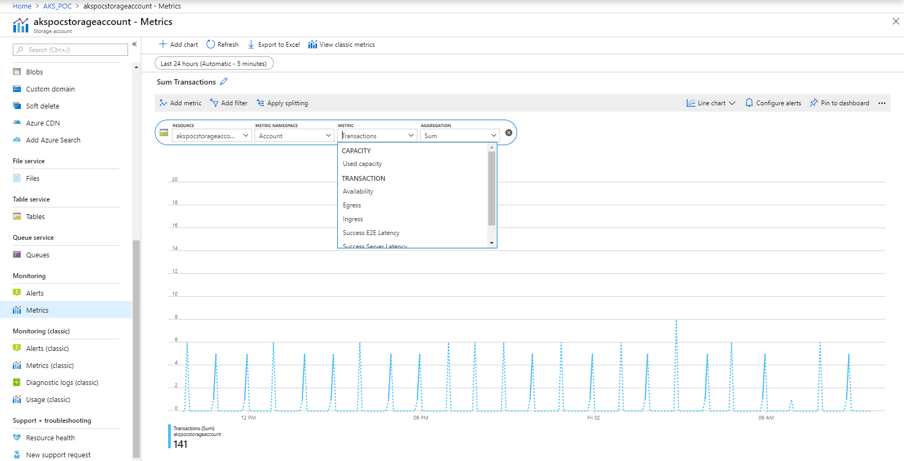

# Tuning and Scaling Files

The file storage will have a max request rate of 20000:

https://docs.microsoft.com/en-us/azure/storage/files/storage-files-scale-targets

If more is required, we will need to create additional file storage instances until the premium storage option for Azure files is available.

Alternatively, an NFS server can be created to serve files to the PODs.

Usually, a CDN would also be used to serve static content, thereby reducing the IO requirements on backend storage for media etc.

Performance can be monitored and pinned to the dashboard via the metrics option on the left hand side:

