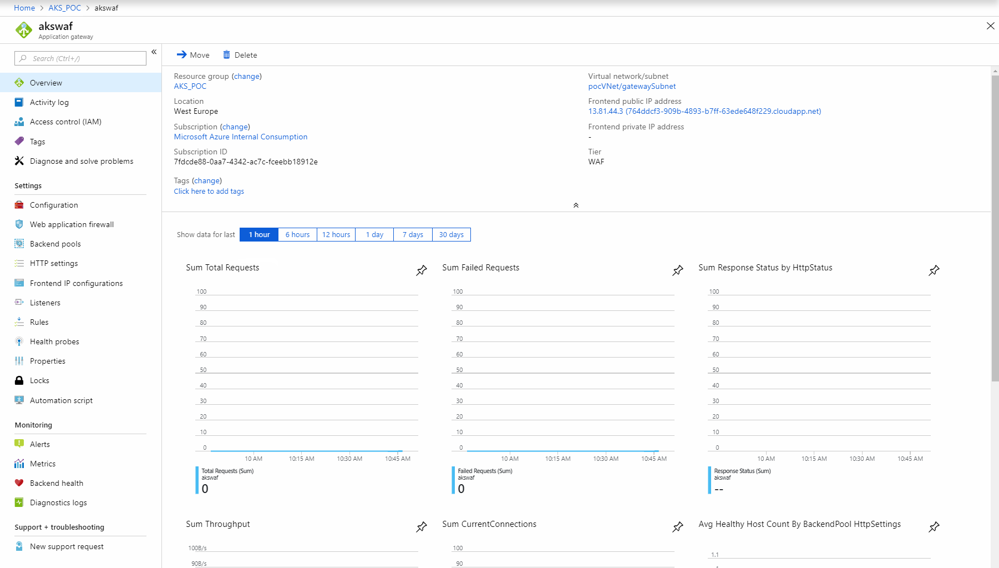
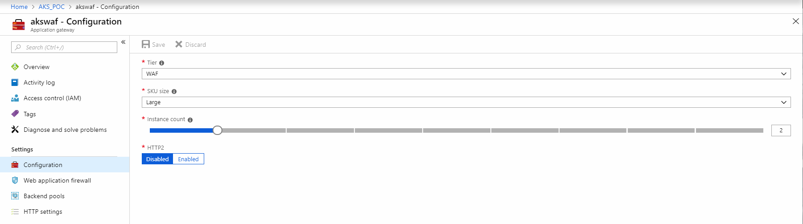

# Tuning and Scaling Web Application Firewall / WAF

Throughput and performance of the WAF can be monitored via the metrics shown in the WAF overview section.
These can be pinned to a dashboard for convenience during the POC:




The WAF can be scaled dynamically via command line:

```shell
 az network application-gateway update -g AKS_POC -n akswaf --capacity <number of instances you need here>
```

or the GUI, there should be no downtime for this action:

1. Select the WAF
2. Select Configuration
3. Scale the instance count



The more rules that are configured, the slower the throughput, and potentially more instances that will be required for highest throughput.