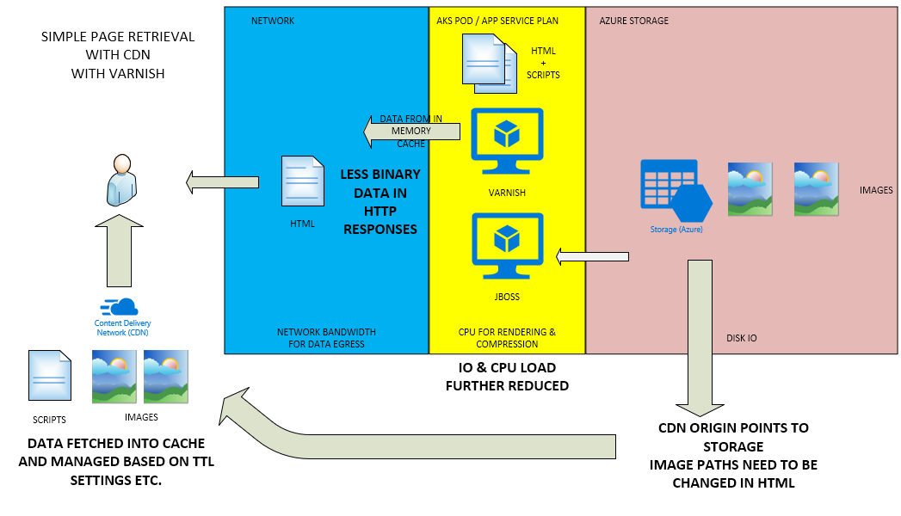

# WHY CDN?

An Azure Content Delivery network will provide several benefits to down stream systems which would otherwise be responsible for rendering and delivery of web content.

First, let us consider a simplified scenario (no Database) and its' archiecture without CDN.  
Let us review the data flows, as well as the origin of our data, and how it must be processed to be rendered for clients:

A typicical optimization, is to place a varnish cache infront of the web / app server, to reduce the processing needed to serve the same web (HTML) content for different requestors:

In an Azure cloud environment, one of the cost factors will be the "egress" (outbound) data.  
This coupled with the limits of any in memory cache vs the number of different requests and binary data (media, downloads etc) being served by the web app, will mean that we can greatly increase the efficiency and scalability of our solutions, by configuring CDN.

CDN offloads the job of serving static data and binary data to our users, by placing it in globally distributed caches provided by CDN partners like Akamai, Verizon and now recently also Azure CDN services.  

The benefits are not only seen in terms of reduced bandwidth / egress costs (reduced as this is the unit of charge for CDN providers), but also in terms of scalability of the web servers and varnish caches, as they no longer need to process, render and serve binary content. 

